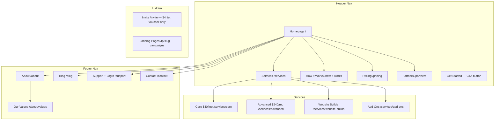

# Fast Web Guru — Site Architecture
## Corey Haines Framework: Step 3

*Created: 2026-06-07 | Source: NEW branddna.md + product-marketing.md*
*Built using Corey Haines site-architecture framework v2.0*

> **Site type:** Hybrid — marketing site (acquire + convert visitors) + ecommerce portal (WHMCS, for existing clients). This document covers the **public-facing marketing site only**.

---

## 1. Page Hierarchy (ASCII Tree)

```
Homepage (/)
├── Services (/services)
│   ├── Core — $40/mo (/services/core)
│   │     "AI-enhanced hosting + human support. Same-day updates."
│   ├── Advanced — $240/mo (/services/advanced)
│   │     "Full ecommerce and AI infrastructure. Your dedicated team."
│   ├── Website Builds (/services/website-builds)
│   │     "New websites from $240. AI-editable. Built fast."
│   ├── Cortex AI (/cortex)
│   │     "Add AI to your website — $30/month. Three pillars. Any host."
│   │   ├── Host Systems (/cortex/host-systems)
│   │   │     "AI-native hosting with Talk-to-Edit. Part of Cortex $30/mo bundle."
│   │   ├── Team Stack (/cortex/team-stack)
│   │   │     "Business DNA + AI brain + AI Specialist. Part of Cortex $30/mo bundle."
│   │   └── Ops Grid (/cortex/ops-grid)
│   │         "20 bespoke growth workflows to work through with your team — more added regularly. Part of Cortex $30/mo bundle."
│   └── Add-Ons (/services/add-ons)
│         "AI Extender, Enhanced AI, Legacy WordPress options."
├── How It Works (/how-it-works)
│     "The 4-step onboarding. Plain English. No jargon."
├── Pricing (/pricing)
│     "One page. All plans. No fine print."
├── Partners (/partners)
│     "Become an advocate. Resell FWG. Earn commission."
├── About (/about)
│   └── Our Values (/about/values)
│         "VS Creative, triple bottom line, community roots."
├── Blog (/blog)
│   └── [Categories TBD — Step 14 of action plan]
├── Support (/support)
│     "Existing clients. Portal login. Help centre."
└── Contact (/contact)
      "Start the conversation."

[Hidden — no nav, no sitemap]
└── Invite (/invite)
      $4 tier. Voucher/direct access only.

[Hidden — campaign landing pages]
└── /lp/[campaign-slug]
      Advocate campaigns, Red Envelope, paid traffic.
```

---

## 2. Visual Sitemap (Mermaid)



---

## 3. URL Map

| Page | URL | Parent | Nav location | Priority |
|------|-----|--------|-------------|----------|
| Homepage | `/` | — | — | Critical |
| Services (hub) | `/services` | Homepage | Header | High |
| Core — $40/mo | `/services/core` | Services | Header dropdown | High |
| Advanced — $240/mo | `/services/advanced` | Services | Header dropdown | High |
| Website Builds | `/services/website-builds` | Services | Header dropdown | High |
| **Cortex AI** | **`/cortex`** | Services | Header dropdown | **High** |
| Cortex Host Systems | `/cortex/host-systems` | Cortex | Cortex dropdown | High |
| Cortex Team Stack | `/cortex/team-stack` | Cortex | Cortex dropdown | High |
| Cortex Ops Grid | `/cortex/ops-grid` | Cortex | Cortex dropdown | High |
| Add-Ons | `/services/add-ons` | Services | Header dropdown | Medium |
| How It Works | `/how-it-works` | Homepage | Header | High |
| Pricing | `/pricing` | Homepage | Header | Critical |
| Partners / Advocates | `/partners` | Homepage | Header | High |
| About | `/about` | Homepage | Footer | Medium |
| Our Values | `/about/values` | About | Footer | Medium |
| Blog | `/blog` | Homepage | Footer | Medium |
| Support + Login | `/support` | Homepage | Footer | Medium |
| Contact | `/contact` | Homepage | Footer | High |
| Invite (hidden) | `/invite` | — | No nav | — |
| Campaign LPs | `/lp/[slug]` | — | No nav | — |

---

## 4. Header Navigation Spec

**Primary nav (left to right):**
1. Services *(dropdown)*
2. How It Works
3. Pricing
4. Partners
5. `[Get Started]` *(CTA button — rightmost)*

**Services dropdown contents:**
- Core — $40/mo
- Advanced — $240/mo
- Website Builds
- Cortex AI *(with sub-items: Host Systems / Team Stack / Ops Grid)*
- Add-Ons

**Also in header (top-right utility area):**
- Client Login → `/support` → redirects to WHMCS portal

**Design notes:**
- Logo (left) links to homepage
- 5 primary nav items + CTA button keeps decision count below the 4–7 maximum
- CTA button copy: **"Get Your Free AI Assessment"** → opens assessment form (name + email + website URL)

---

## 5. Footer Spec

**Column 1 — Services:**
- Core ($40/mo) → `/services/core`
- Advanced ($240/mo) → `/services/advanced`
- Website Builds → `/services/website-builds`
- Cortex AI → `/cortex`
- Pricing → `/pricing`

**Column 2 — Company:**
- About → `/about`
- Our Values → `/about/values`
- Partners & Advocates → `/partners`
- Blog → `/blog`

**Column 3 — Support:**
- How It Works → `/how-it-works`
- Client Login → `/support`
- Contact → `/contact`

**Column 4 — Legal:**
- Privacy Policy → `/privacy`
- Terms of Service → `/terms`

---

## 6. Breadcrumb Implementation

All pages at L2 and deeper show breadcrumbs. Format: `Home > [L1 Section] > [Current Page]`

| URL | Breadcrumb |
|-----|-----------|
| `/services/core` | Home > Services > Core |
| `/services/website-builds` | Home > Services > Website Builds |
| `/about/values` | Home > About > Our Values |
| `/blog/[post-slug]` | Home > Blog > [Post Title] |

---

## 7. Internal Linking Plan

### Hub pages and their spokes

**Homepage** is the primary hub. Links to all L1 sections.

**Pricing (/pricing)** is a conversion hub. Should receive internal links from:
- Homepage (hero CTA + section CTA)
- All service pages (end-of-page CTA)
- How It Works (end-of-page CTA)
- Partners page (pricing context for wholesale)

**How It Works (/how-it-works)** is the anxiety-reduction hub. Should receive links from:
- Homepage (objection-handling section)
- All service pages (trust-building link)
- Pricing page ("How does it work? →")

**Partners (/partners)** is the wholesale acquisition hub. Should receive links from:
- Homepage (dedicated section)
- About/Values (alignment with community model)
- Blog posts (where relevant to agency audience)

### Blog — hub-and-spoke model (for Phase 5)
Content pillars will define topic clusters. Each cluster has one pillar page (hub) and multiple supporting posts (spokes). TBD after content strategy session.

### Cross-section link opportunities
| From page | To page | Reason |
|-----------|---------|--------|
| `/services/core` | `/how-it-works` | Reduce "is this complicated?" anxiety |
| `/services/core` | `/pricing` | Move to decision |
| `/services/advanced` | `/services/website-builds` | Natural upsell path |
| `/about` | `/partners` | Values alignment → wholesale interest |
| `/about/values` | `/partners` | Same audience path |
| `/pricing` | `/how-it-works` | "Not sure yet? See how it works" |
| `/contact` | `/how-it-works` | Pre-sales education |

---

## 8. Architecture Decisions & Rationale

**Why one homepage (not audience-split):**
The Brand DNA specifies the wholesale/agency market as primary and direct SMBs as secondary. One homepage with a "who this is for" section handles both without splitting traffic and diluting SEO. A dedicated `/partners` page captures the wholesale journey more deeply.

**Why `/pricing` is separate from `/services`:**
The pricing page is a conversion destination. Giving it its own URL means it can be linked directly from ads, emails, and the advocate campaign materials without confusing visitors with feature content. It also allows the "no gatekeeping" story to be told cleanly in one place.

**Why `/how-it-works` is a top-level page:**
The Brand DNA's core product (BugHerd/Claude chat-to-update, triple redundancy, Business in a Box workflow) is genuinely novel and will generate anxiety ("is this complicated?") in prospects. A dedicated explainer page reduces that friction before it kills conversions. This page is not in the nav dropdown — it's a direct primary nav item because it's frequently the second page a cautious visitor reads.

**Why `Partners` is in primary nav (not footer):**
The wholesale/agency channel is described in the Brand DNA as the primary growth driver. It earns a primary nav position. Burying it in the footer treats it as an afterthought.

**Why the $4 tier has no nav presence:**
The Brand DNA is explicit: the $4 tier is invite-only, not promoted publicly. The `/invite` page exists only as a direct-link destination for voucher holders and charity partners. Zero SEO, zero nav.

---

## 9. Pages Deferred to Phase 2

The following pages are in-scope for the site eventually but are not needed at launch. Do not design or write copy for these until Phase 2:

- Individual portal/partner brand pages (e.g. Vanilla & Spice as a FWG vendor)
- Case studies / customer success stories (needs testimonials first)
- Resources / templates library
- Comparison pages (`/vs/[competitor]`)
- Programmatic SEO pages (location + industry combos)
- Careers / join the team

---

## 10. Open Questions Before Development Starts

`[GAP — resolve before handing to developer]`

1. **Primary CTA button copy** — confirmed as "Get Your Free AI Assessment" (or close variant). Assessment form collects: name, email, website URL. Returns tailored AI marketing suggestions.
2. **Client login URL** — does `/support` redirect straight to WHMCS, or is there an intermediate page?
3. **Blog categories** — to be defined in content strategy session (Step 14 of action plan). Blog can launch as flat `/blog` with no categories until then.
4. **Geographic targeting** — confirmed: Australia-wide, initial focus on Hunter Valley, Newcastle, Sydney, Melbourne, Yarra Valley. This should inform local SEO and any location-specific landing pages in Phase 2.
5. **Domain** — is the site at `fastwebguru.com.au`, `fastwebguru.com`, or both?
6. **Cookie/GDPR** — Australian privacy law requirements; confirm need for cookie banner.
7. **Tech stack** — the Brand DNA describes full-code websites on Vercel/Astro + Supabase for clients. Is the FWG marketing site itself being built on this stack as a live demonstration? Or a simpler CMS for speed?
